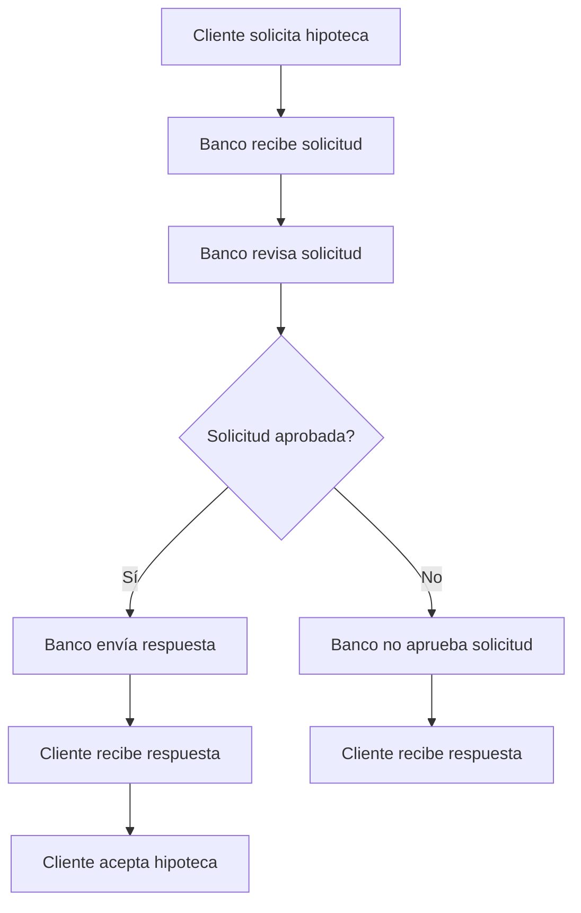

# JUPYTER NOTEBOOKS

Cuando trabajamos con python, lo que hacemos es crear ficheros .py que contienen código fuente.
Este código fuente es interpretado por el intérprete de Python, que ejecuta las instrucciones que hemos escrito.
Ese programa es el que ejecutamos desde una terminal:

`python mi_programa.py`

Eso está guay.. cuando monto programas más complejos... o mejor dicho.. otro tipo de programas.

Existe una herramienta que se llama JUPYTER que nos permite ejecutar código Python de una forma más interactiva y además ir documentando fácilmente lo que hacemos y lo que vemos (el resultado del programa)

Eso es muy útil para **ANÁLISIS DE DATOS**.

Al usar Jupyter, creamos lo que se denomina un "notebook", que es un fichero con extensión .ipynb que contiene tanto el código como el resultado de su ejecución y cualquier anotación que queramos hacer.

Esos archivos no podemos ejecutarlos directamente con el intérprete de Python, sino que necesitamos JUPYTER para poder abrirlos y ejecutarlos.

Dentro de un cuaderno jupyter, vamos añadiendo BLOQUES.
Hay 2 tipos de bloques:
- Bloques de CÓDIGO: donde escribimos código Python que podemos ejecutar.
- Bloques de DOCUMENTACIÓN: donde escribimos MARKDOWN, que nos permite escribir texto enriquecido, con formato, enlaces, imágenes, etc.

Los bloques de documentación hay que solicitar su formateo.
Para los bloques de código es diferente.. lo que solicitamos es su ejecución...
Y para poder ejecutar un trozo de código necesitamos un intérprete de Python... Pero ese intérprete va a estar ejecutándose continuamente en **background**.

En el mundo Jupyter, el intérprete de Python que se ejecuta en background se denomina **KERNEL**.

# BPMN

Es un estándar para la representación/intercambio/almacenado de procesos de negocio.

Muchos programas de modelado de procesos utilizan BPMN como su formato de intercambio estándar.
Igual que el word guarda ficheros .docx, los programas de modelado de procesos guardan sus ficheros en formato .bpmn.
Es un formato estándar que cualquier programa de modelado de procesos puede leer y escribir.

Pero BPMN no es sólo un formato de intercambio, sino que también es un estandar para la definición de procesos de negocio.

Define qué componentes puede tener un proceso de negocio y cómo se relacionan entre sí.
Los componentes básicos de un proceso de negocio son:
- **Tareas**: Son las actividades que se realizan en el proceso.
- **Eventos**: Son los puntos de inicio y fin del proceso, así como los puntos de control que pueden ocurrir durante el proceso.
- **Puertas de enlace**: Son los puntos de decisión del proceso, donde se toma una decisión sobre qué camino seguir.
- **Flujos de secuencia**: Son las conexiones entre los diferentes componentes del proceso, que indican el orden en el que se ejecutan las tareas y eventos.
- **Grupos**: Son una forma de agrupar tareas y eventos relacionados entre sí, para facilitar la comprensión del proceso.

## RESUMEN                     
                                                                        DISCOVERY
                                                   variable log         alg. inductivo
                                                                        variable process_tree

    CARGA DATOS   --->   PREPARAR LOS DATOS  --->  CARGAR DATOS  ---->  GENERAR UN MODELO    ---------> GENERADO UN MODELO
    desde csv                                       EN PM4PY            FORMAL que recoja TODOS            PETRI
                                                                        los casos del log
                                                                                             ---------> GENERADO UN MODELO
                                                                                                           BPMN
 --------------------------------------------       -----------------------------------------------------------------------------
                PANDAS                                                  PM4PY

Una cosa son los datos.
De esos datos genero un MODELO MATEMATICO que sea capaz de encajar con TODOS Y CADA UNO DE LOS DATOS que tengo en el log (a su vez csv).

Una cosa es un MODELO, otra cosa es su representación gráfica o en fichero.

El MODELO es un programa ejecutable, que contiene entre otras cosas, una definición de proceso.
Esa definición de proceso puede ser representada gráficamente.

    EL MODELO (La variable que nos genera pm4py) es un objeto al que puedo pedirle, ejecútate simulando que tienes 4 personas para hacer esta tarea a ver cómo va la cosa.
    Compáralo con otra simulación donde supongamos que tienes 5 personas para hacer esa tarea.
    Mejoramos algo? o no?

El process tree es un modelo matemático que recoge todos los casos del log.
El modelo que se nos genera en BPMN o en Petri no tiene por qué recoger todos los casos del log.
Quizás hay casos que no se van a ajustar a esos modelos.

---

Los procesos de negocio son jodidos. Por eso estamos en esta guerra.

A veces tenemos sistemas informáticos que estandarizan a más no poder un proceso de negocio... y fuerzan completamente un flujo de trabajo.
Otras veces no.

Imaginad: PROCESO DE SOLICITUD DE HIPOTECA
- El cliente solicita la hipoteca. <- TAREA
- El banco recibe la solicitud. <- TAREA
- El banco revisa la solicitud. <- TAREA
- El banco aprueba la solicitud. <- TAREA
- El banco no aprueba la solicitud. <- TAREA
- El banco envía la respuesta al cliente. <- TAREA
- El cliente recibe la respuesta. <- TAREA
- El cliente acepta la hipoteca (si se le aprobó). <- TAREA
- El cliente no acepta la hipoteca (si no se le aprobó). <- TAREA

Eso es cómo debería de funcionar el proceso... Lo que pone en los papeles.
Pero quizás, antes de que el banco mande al cliente la respuesta, el cliente llama al banco para preguntar por su solicitud. Y le informan... y no hay comunicación oficial.

En otros caso, quizás se le informa 3 veces... por error.

Sea como fuere... todas las tareas las hemos ido registrando.

Un PROCESS TREE se construe de tal forma que encaje con todos los casos de estudio.

El BPMN o el PETRI se construyen de forma que encajen con la mayor cantidad posible de casos de estudio.... pero a su vez sin complicar demasiado el modelo (proceso).

BPMN o PETRI son simplificaciones del PROCESS TREE.
Ajustarán en un determinado % de casos del log.... DEBERIA ser el 100% ojala!
En muchos escenarios no será así... habrá ANOMALIAS.
Pero esas ANOMALIAS no son errores, son casos que no se ajustan al modelo.
Y querré:
- Forzar a que esos casos encajen con el modelo.
- O bien, forzar a que el modelo se ajuste a esos casos.
- Podré montar modelos alternativos para esas anomalías.

A una red de petri o a un bpmn les puedo calcular el fitness.
El fitness es un valor que me dice qué tan bien se ajusta el modelo a los casos del log. 0-1 :
    0 = RUINA ! Ningún caso del log se ajusta al modelo.
    1 = PERFECTO! Todos los casos del log se ajustan al modelo.

A veces el BPMN no lo genero desde el process_tree... Me viene dado un BPMN, que han generado los analistas de negocio (según viene definido en un procedimiento técnico de la organización).
